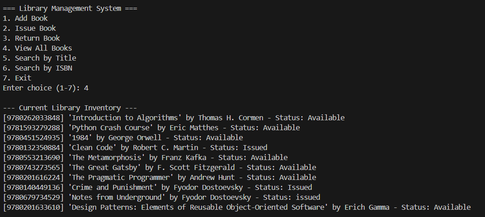
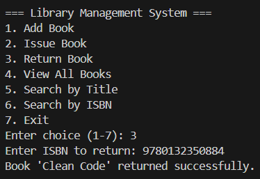
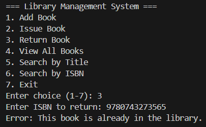
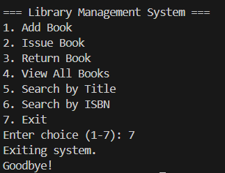

# Library Inventory Manager

## 📖 Project Overview

The Library Inventory Manager is a lightweight, command-line interface (CLI) application designed to help library staff manage book records efficiently. Built with Python, it applies Object-Oriented Programming (OOP) principles to track book status (Available/Issued), search the catalog, and ensure data persistence using JSON files.

## ✨ Features

- **Book Management:** Add new books with Title, Author, and ISBN.

- **Circulation:** Issue and Return books, updating their status in real-time.

- **Search:** Find books quickly by Title (keyword search) or ISBN (exact match).

- **Data Persistence:** Automatically saves and loads the inventory from library_data.json, ensuring data is never lost between sessions.

- **Robust Error Handling:** Uses try-except blocks to handle missing files or corrupted data gracefully.

- **Logging:** Records all major system events (additions, issues, returns) to library_system.log.

## 📂 Project Structure

```
library-inventory-manager/
├── library_data.json        # Persistent data storage (JSON format)
├── library_manager.py       # Main application code (Classes + CLI)
└── library_system.log       # Log file (Auto-generated)
output_screenshot/           # screenshots of ouput in CLI
    ├── PY1.png
    ├── PY2.png
    ├── PY3.png
    └── PY4.png
README.md                    # Project documentation
```

🖥️ Output Example (Screenshot)









## 📜 Dependencies

This project uses Python's standard library. No external pip installations are required.

- **json:** For data storage.

- **os:** For file path handling.

- **logging:** For tracking system events.

## 👤 Author

### Name: Aman Saklani
### Roll no: 2501410042
### Course: Programming for Problem Solving using Python